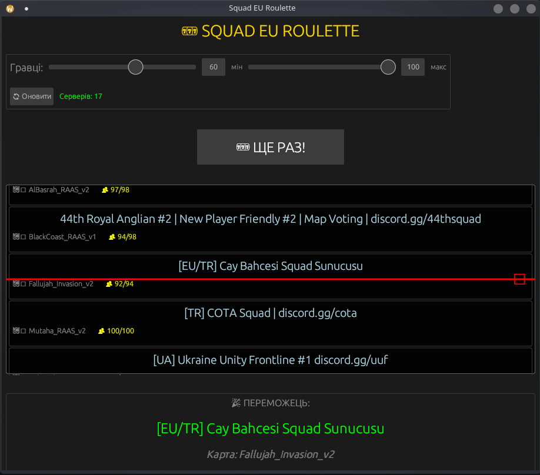

# 🎰 Squad EU Roulette v1.0

Рулетка для вибору серверів у грі **Squad**. Працює через BattleMetrics API.
Написано на **Rust** з використанням `egui` та `rodio`.



## 🔥 Особливості
* **CS:GO Style Animation:** Фізика "важкого колеса" з Quintic easing.
* **Audio:** Генерація звуку "тріщання" (white noise) без зовнішніх файлів.
* **Config:** Легке налаштування швидкості та кількості обертів у коді.
* **Smart Parsing:** Фільтрує тільки EU сервери (UA, DE, GB, PL, etc.).

## 🚀 Як запустити
1. Завантажте `.exe` з вкладки **Releases**.
2. Запустіть файл.
3. Натисніть **"Оновити"**, щоб підтягнути список серверів.
4. Крутіть рулетку!

## 🛠️ Для розробників (Build)
Вам знадобиться встановлений Rust.

```bash
git clone https://github.com/69-Lukash/squad_roulette.git
cd squad_roulette
cargo run --release